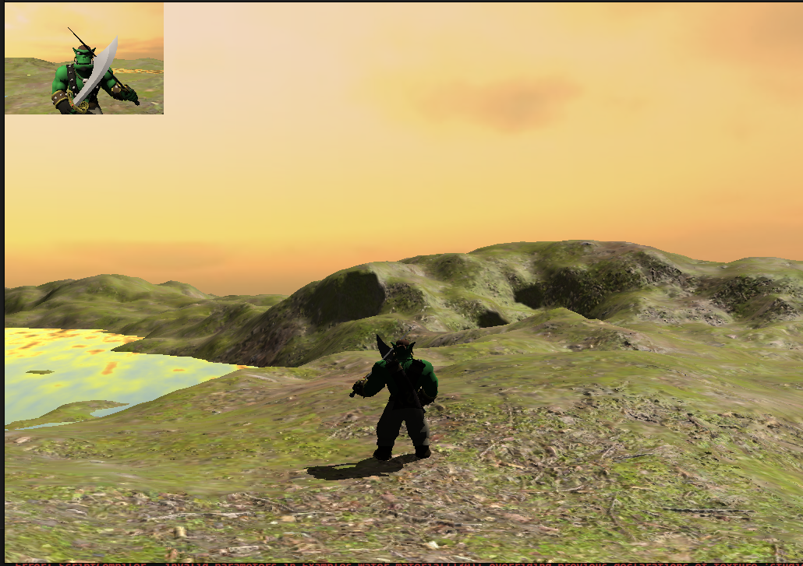

# buOgre

A compact Ogre3D + buLanguage sandbox for experimenting with rendering, scripting, and custom engine bindings. The focus is to show how quickly you can wire a complex C++ engine to a clean scripting layer while keeping performance and flexibility.

## Highlights

- Ogre3D rendering with buLanguage scripting
- Example scenes (terrain, water, Sinbad character)
- Custom bindings that expose engine features to scripts
- Simple workflow for rapid iteration

## Requirements

- CMake 3.20+
- C++17 toolchain
- Ogre3D (RTShaderSystem, Overlay, Terrain components)
- SDL2
- OpenGL

## Build

```bash
cmake -S . -B build
cmake --build build -j
```

The executable is placed in `bin/` as `main`.

## Run

You can pass a script path, or let it fall back to the default script search paths.

```bash
./bin/main bin/scripts/sinbad_terrain.bu
```

Script search paths at runtime:
- `./bin`
- `./scripts`
- `./bin/scripts`
- `.`

## buLanguage + Bindings

This project uses buLanguage to script Ogre3D scenes and shows how fast it is to build complete bindings for a complex engine like Ogre3D. The goal is to keep scripting simple while retaining native performance and access to engine features.

buLanguage VM:
```text
https://github.com/akadjoker/BuLangVM
```

## Scripts

Example scripts live in `bin/scripts/`.

- `bin/scripts/sinbad_terrain.bu`
- `bin/scripts/terrain_dacing.bu`

## Video


[](https://www.youtube.com/watch?v=MK84TQXPrr4)

## Screenshots




## Notes

- Assets are expected under `assets/` and `media/` as referenced by the scripts.
- This repo is intended as a practical, hands-on demo rather than a full engine or framework.
